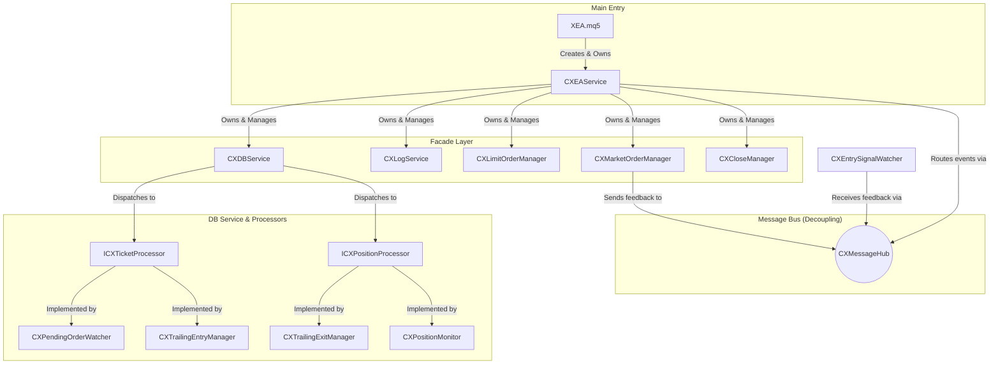

# ABC Project - XEA 아키텍처 설계서 (v1.2)
**Last Modified: 2026-04-25 10:20:00**

## 1. 아키텍처 개요
본 시스템은 **Facade** 및 **Mediator(MessageHub)** 패턴을 중심으로 설계된 고성능 MQL5 자동 매매 엔진입니다. **`Single Scan - Multi Dispatch`** 패턴과 **`Interface-based Processor Registry`**를 적용하여 클래스 간 결합도를 최소화하고 확장성을 극대화했습니다.

## 2. 최종 클래스 참조 관계도 (Facade 적용)

## 3. 핵심 설계 원칙

### 3.1 Facade 패턴
- `XEA.mq5`는 오직 `CXEAService`의 단일 인스턴스만 참조하며, 모든 하위 서비스 및 모듈의 Life-cycle은 `CXEAService`가 전담합니다.

### 3.2 인터페이스 기반 등록 (Processor Registry)
- `CXDBService`는 `ICXTicketProcessor`와 `ICXPositionProcessor` 인터페이스에만 의존하며, 구체적인 처리 모듈을 알지 못합니다.
- 새로운 오더/포지션 관리 로직 추가 시, `CXDBService` 수정 없이 인터페이스 구현 클래스를 생성자에서 등록하기만 하면 됩니다.

### 3.3 Single Scan - Multi Dispatch
- 터미널 자원 최적화를 위해 `CXDBService`에서 오더/포지션을 단 한 번 스캔하고, 등록된 모든 프로세서에 티켓 정보를 배분합니다.

## 4. 데이터 흐름 및 트레이딩 로직

### 4.1 데이터 흐름
1. **신호 감지**: `CXEntrySignalWatcher`가 DB에서 신호 포착 → `MessageHub` 전송.
2. **실행**: `CXEAService`가 메시지 수신 후 전담 `Manager`에게 라우팅 → 터미널 주문 실행.
3. **피드백**: 주문 성공 시 `Manager`가 확인 메시지 발행 → `Watcher`가 수신하여 DB 신호 즉시 제거.

### 4.2 트레일링 전략
- **진입(Enter)**: `te_start`(활성화), `te_step`(반등 진입 트리거), `te_limit`(도망가기 이격).
- **청산(Exit)**: `ts_start`(활성화), `ts_step`(반락 청산 트리거), `ts_limit`(추격 이격).

## 5. 향후 개선 계획 (v1.3)
- **동적 파라미터 로딩**: `channel_configs` DB 테이블을 신설하고, `CXTrailingInstance` 생성 시 `cno`를 기준으로 트레일링 파라미터(`te_`, `ts_`)를 동적으로 로드하도록 구현합니다.
- **백테스팅 및 최적화**: 구현된 전략의 유효성을 검증하고, 각 파라미터의 최적값을 탐색합니다.
