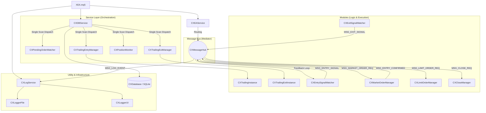

# ABC Project - XEA 아키텍처 설계서 (v1.0)
**Last Modified: 2026-04-24 15:35:00**

## 1. 아키텍처 개요
본 시스템은 **Mediator(MessageHub)** 패턴과 **Single Scan - Multi Dispatch** 패턴을 결합하여 고성능과 저결합성을 동시에 달성한 MQL5 기반 자동 매매 엔진입니다.

## 2. 클래스 간 참조 및 통신 관계도

## 3. 핵심 설계 원칙

### 3.1 관심사의 분리 (Decoupling)
- **Watcher**: DB 정합성(신호 감지 및 제거)에만 집중.
- **Manager/Instance**: 실시간 오더 운용(트레일링 로직 등)에만 집중.
- 모든 비즈니스 로직은 `CXMessageHub`를 통해 비동기적으로 소통하며, 실행기와 감시자 간의 직접 참조를 0% 유지함.

### 3.2 Single Scan - Multi Dispatch
- 터미널 자원 최적화를 위해 `CXDBService`에서 오더/포지션을 단 한 번 스캔.
- 스캔된 티켓 정보를 각 모듈(`Process(ticket)`)에 배분하여 중복 루프 제거 및 성능 극대화.

### 3.3 트레일링 전략 파라미터
- **진입(Enter)**: `te_start`(활성화), `te_step`(반등 진입 트리거), `te_limit`(도망가기 이격).
- **청산(Exit)**: `ts_start`(활성화), `ts_step`(반락 청산 트리거), `ts_limit`(추격 이격).
- 모든 파라미터는 포인트(Points) 단위로 설정되며, 각 채널(`cno`)별 독립 인스턴스에서 가격으로 변환되어 적용됨.

## 4. 데이터 흐름 (Data Flow)
1. **신호 감지**: `EntryWatcher`가 DB에서 신호 포착 → `MessageHub` 전송.
2. **실행**: `EAService`가 메시지 수신 후 전담 `Manager`에게 라우팅 → 터미널 주문 실행.
3. **피드백**: 주문 성공 시 `Manager`가 확인 메시지 발행 → `Watcher`가 수신하여 DB 신호 즉시 제거.
4. **운용**: `TrailingManager`가 터미널의 대기 오더를 감시하며 설정값에 따라 실시간 진입가 수정 및 시장가 전환.
